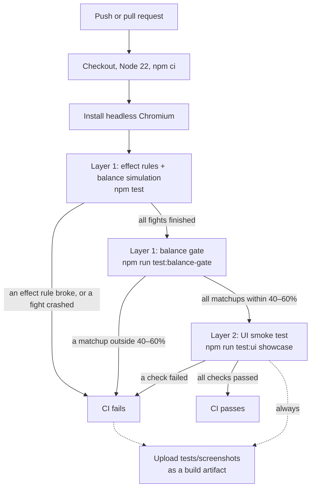

# Testing

Drake Arena is a single HTML file with no build step, so the tests work on that file as it is. The testing has two layers:

1. **Effect rules, ultimates and balance simulation** (`tests/effects.js`, `tests/ultimates.js`, `tests/balance.js` + `tests/sim_harness.js`) run the real game code in Node. The effect and ultimate tests check the buff/debuff, meter and ultimate rules; the balance sim plays thousands of fights. Together they answer: *do the rules work as written, is the game fair, and does combat ever crash?*
2. **UI smoke test** (`tests/ui.js`) opens the page in headless Chromium, plays it through fake chat and checks the layout rules. It answers: *does it work and look right on stream?*

Both run in CI on every push and pull request (`.github/workflows/ci.yml`).

## Pipeline



## Layer 1: effect rules

`effects.js` (`npm run test:effects`, also the first step of `npm test`) loads the game script the same way the balance sim does (`tests/game_env.js`: stub page, instant timers, seeded `Math.random`) and checks the 12 buffs/debuffs in the `EFFECTS` table. It takes about a second.

| Check | What it catches |
|---|---|
| 12 effects; each viewer element has one buff and one debuff; each has an icon, Ukrainian and English names, a description with every `{number}` filled in, a duration unit and a count | A half-added effect, a typo in the table, a description that shows `{dmg}` or `NaN` |
| Stoneskin and Armor Break are gone from the game file | The removed effects creeping back |
| Chip text in both languages, including Ukrainian plurals (1 атака / 2 атаки / 5 атак / 21 атака) | "ще 5 атаки"-style grammar slips |
| Effect power (Purple + an effect-strength title) scales the percentages but not the count | Purple making effects last longer |
| Refresh: casting an active effect resets its count and is logged. Replacement: a third buff/debuff replaces the one closest to ending (the older one on a tie), and the log names both. Dispel removes every buff and takes no slot | Stacking duplicates, replacing the wrong effect, silent replacements |
| Debuff immunity (title and White Dragon) ignores all 6 debuffs, Dispel included, and keeps its own buffs | Immunity lost in the rework, or a debuff that skips the check |
| Casting split: Red picks its own pair ~75% of the time (70% + 30% × 2/12), half of those the buff; the White Dragon picks evenly from all 12 | A wrong split or a broken random pick |
| **Real fights** (300 per language, all elements, ability titles, the White Dragon): before every `[Turn N]` log line, every active effect's count is compared with the state after the previous turn or cast. Own-attack effects must drop by 1 when their owner attacks, hits-taken effects when their owner is attacked (blocked or not), turn effects when their owner's turn starts. On a frozen turn only the owner's turn effects and Frost itself go down. An effect may only disappear when its count reaches 0 | A count going down on the wrong event, by 2, or not at all; Frost eating other buffs; effects vanishing early |
| No internal effect id (`rage`, `mark`, ..., or the old `stoneskin`) appears in any battle-log line, in either language, and all 12 effect names show up | Log text built from the id instead of the table |
| An immune fighter never carries a debuff during a real fight | Immunity bypassed by a title mechanic (chaos, cat) |
| No effect name (uk or en, whole word) or icon appears anywhere in `showcase/index.html` outside the `EFFECTS` block, comments excepted. Lines that use an icon or word for something unrelated (🛡️ on Ultra Block and the defence label, title icons like 🎯 Missed the Button, the Guardian title's "Щит надії / Shield of Hope", ...) are listed in `EFFECT_TEXT_ALLOWLIST` in `effects.js`, each with its reason. An allowlist entry that no longer matches a line also fails | An effect name or icon typed into the code instead of read from `EFFECTS`, which would go out of date on the next rename |
| **Cast chance** with fixed dice, for a plain drake (30%), a Purple level-20 drake (30 + 20 + 15 = 65%) and a plain drake with a +15% effect-chance title (45%). The line comes from the rule, not from the game. A damaging hit casts on a roll 0.5 under the line, not on the line or 0.5 over it; an ultra-blocked hit (0 damage) never casts, even on a roll of 0 | A wrong cast chance, a missing element or title bonus, an off-by-one at the line, casts on hits that did no damage |
| **What each effect does** (one test per effect, below) | An effect that has the right name and count but the wrong effect on the fight |

**What each effect does.** These tests script single turns of the real fight loop. Two plain level-20 drakes (no element, no title, 340 HP) fight with fixed dice, so a turn's damage is exact. Each test casts the effect with the game's own `applyEffect`, runs the same turns with and without it, and checks the difference against the numbers in `EFFECTS` (rounding tolerance: the two sides come from the same float). Every effect with numbers runs twice: at power ×1, and cast by a Purple level-20 drake with an effect-strength title (power ×1.8). The numbers must scale with power; the count must stay the same.

| Effect | What the test checks (current numbers, power ×1 → ×1.8) |
|---|---|
| 💢 Rage | The owner's attack is ×(1 + `dmg`%): 29 → 41 / 50. A raging drake takes ×(1 + `taken`%): 29 → 34 / 37 |
| 🔥 Burn | −`hp`% of max HP at the start of the target's turn, never on the attacker's turn: −17 / −31 |
| 🛡️ Shield | −`cut`% on **every** kind of hit, by the same factor: magic 29 → 20, armour-piercing 41 → 29, vampire 41 → 29 (×1.8: 13 / 19 / 19) |
| ❄️ Frost | The frozen drake's attack is skipped once (the target keeps full HP); the next turns are normal |
| 🌑 Shadow | A block roll inside the extra `block`% is blocked only with Shadow; a roll just past it still hits |
| 🥀 Weakness | The target's attack is ×(1 − `cut`%): 29 → 18 / 8 |
| 🍀 Blessing | A crit roll just above the plain 34% crits only with Blessing (+`crit`%), for ×1.5 damage |
| 🎯 Mark | The next hit crits even on a roll that never crits; the hit after it is normal again |
| 🌟 Divine Might | The attack is ×(1 + `dmg`%): 29 → 45 / 58, and a hit that would be ultra-blocked goes through |
| 💨 Dispel | All the target's buffs are removed at once |
| 💚 Regeneration | +`hp`% of max HP at the start of the owner's turn: +22 / +40 |
| ☠️ Poison | −`hp`% of max HP per turn (−10 / −18), and the target's healing is ×(1 − `healCut`%): Regeneration +22 → +11, a vampire hit's heal +21 → +10 (×1.8: +2 / +2) |
| All lasting effects | Effect power never changes the count (11 effects at ×1 and ×1.8) |

It also checks that the effect descriptions come from the table: every number in `nums` appears as a `{placeholder}` (`{cut}` → "30", `{x:dmg}` → "×1.55"), no digit is typed into the text, changing the table's numbers changes the text, and the README's effect table shows exactly the game's English descriptions. After the next balance change, the descriptions update on their own and `npm test` says if the README needs the new numbers.

A Dispel that would find no buffs is cast as a different effect instead (from the caller's pool for Chaotic charge, so it stays a debuff). On an immune target it still counts as cast and is logged as ignored. In the fight run, every Dispel cast is checked: none may land on a target with no buffs.

## Layer 1: class ultimates

`ultimates.js` (`npm run test:ultimates`, part of `npm test`) loads the game the same way and plays scripted turns of the real fight loop with fixed dice. A turn with a full Element Power meter is compared with the same turn without it, and the numbers come from `CLASS_ULTIMATES`.

| Check | What it catches |
|---|---|
| One ultimate per viewer element, each with an icon, both names and a description filled in from its numbers (every number is a `{placeholder}`, none typed in, and changing a number changes the text); the README's ultimate table shows exactly the game's descriptions; the White Dragon has none | A half-added ultimate, a description that goes stale after the next balance change |
| **Meter:** +1 for an own attack that deals damage, nothing for a blocked one; +1 the first time HP drops below half and never again, even after healing back over half and dropping again; at 5 the next turn is the ultimate, the meter goes to 0, and the ultimate doesn't fill it; one short of full is a normal attack; with ❄️ Frost the full meter waits through the skipped turn and fires on the next | A meter that fills on misses, a bonus that repeats, an ultimate that fires twice or never, Frost eating the ultimate |
| ☄️ **Firestorm:** the hit is ×`dmgMult`; a hit that would be ultra-blocked goes through; 🔥 Burn lands with the caster's effect power; an immune target ignores the Burn but takes the full hit | Wrong multiplier, a blockable Firestorm, a Burn that ignores the effect rules, immunity stopping damage |
| 💠 **Ice Mirror:** no attack on its turn; each of the next `hits` hits is absorbed up to `cap`% of max HP, the rest goes through, `back`% of what was absorbed goes to the attacker — checked with ordinary hits (under the cap) and big ones (over it); the hit after that is normal | Swallowing whole hits, sending nothing back, a mirror that never runs out |
| 🦇 **Shadow Theft:** takes the target's buffs with their counts; up to the 2-buff limit (the extra one is removed); a guaranteed crit when the target had none, and no forced crit when it had some; immunity keeps the target's buffs but the attack still lands | Theft past the limit, stealing through immunity, a missing crit |
| 🎰 **Jackpot:** all 27 reel combinations with forced reels: ×(`base` + `perGem` per 💎), a miss at `missAt`+ 💀, the reels shown in the log; in 3,000 random spins the reels land at the table's chances | Wrong multipliers, a 💀💀 that still hits, reels that don't match the table |
| ✴️ **Arcane Detonation:** ×(`dmgMult` + `perDebuff`% per debuff) for 0, 1 and 2 debuffs, then they're gone; the same multipliers for a Purple drake with an effect-strength title | Debuffs left behind, effect power leaking into an ultimate's numbers |
| 🌸 **Bloom:** own debuffs removed first, then +`heal`% of max HP (not halved by ☠️ Poison, since it's gone), no buff gained, no attack | A heal cut by Poison, debuffs left, Regeneration creeping back |
| **90% cap:** at effect power ×25, Shield, Weakness and Poison's healing cut are all 90%; in a fight Shield and Weakness leave ×0.1 of a hit and Poison leaves ×0.1 of a heal (never 0) | An effect that makes a hit or a heal disappear |
| **White Dragon:** 60 fights, it never has a meter point or an ultimate; its card's meter row stays empty | The streamer's dragon getting a meter |
| **Interaction choices** (one test each): an attacking ultimate counts down own-attack and hit effects and rolls the usual cast; Ice Mirror and Bloom make no attack (only "turns" effects count down); Dispel and Shadow Theft can't take Ice Mirror; a blocked hit still uses an Ice Mirror hit; the White Dragon goes straight through Ice Mirror; a stolen 💢 Rage counts for Shadow Theft's own hit; Theft merges a buff the thief already has (the longer one stays, with its power); immunity stops the theft but doesn't force the crit; a Jackpot miss counts down effects and never casts; Detonation removes its debuffs on a blocked hit; the below-half bonus is used up even with a full meter | A later change quietly flipping one of the rules listed under "How ultimates fit with the rest" in the README |
| **Real fights** (480, both languages): every ultimate fires, and no internal ultimate id (`firestorm`, `mirror`, ...) appears in the log | Log text built from ids, an ultimate that never triggers |

`effects.js` covers the rest: its name/icon scan also checks `CLASS_ULTIMATES` (ultimate names and icons appear only in that table, with the same allowlist for unrelated uses), and its real-fight countdown check knows ultimate turns (Ice Mirror and Bloom make no attack; Shadow Theft moves buffs; Detonation and Bloom remove effects).

### Testing the tests: deliberate breakages

`npm run test:mutations` (also part of `npm test`) breaks a copy of the game in 49 specific ways and checks that `effects.js` or `ultimates.js` fails on each one (both run on every copy, in parallel). An unchanged copy runs first and both files must pass, so a broken test setup can't pass as "everything caught". 1–6 are the breakages from the effects rework, 7–8 the Dispel and description rules, 9–11 the effect-behaviour rules, 12–14 the name/icon scan and the cast chance, , 15–38 the meter, every ultimate, the 90% cap and the ultimate name/icon scan, and 39–49 flip each interaction choice:

| # | Breakage (one code change) | Caught by | First failure it printed |
|---|---|---|---|
| 1 | Hits counted on the attacker: `countDownEffects(atkFx, 'hits')` instead of the defender's | Real-fight countdown check | `2283 wrong count change(s), first: turn 1 (attacker @B): @B's shield (hits) went 2 → 1, expected 2` |
| 2 | Effect id in the log: the opening-buff line prints `${id}` instead of the icon and name | Log id scan | `effect ids in the log: "regen" in: 🌅 Woke Up Swinging: @B starts the fight with regen (3 turns left)!` |
| 3 | Refresh doesn't reset: recasting leaves the count where it was | Refresh check (and the replacement check after it, 4 failures) | `[uk] Rage refresh: refreshed, [{"id":"rage","left":1,"power":1}]` |
| 4 | Debuff immunity switched off | Immunity checks for the title and the White Dragon (9 failures) | `[uk] debuff-immunity title: results applied,applied,replaced,replaced,dispelled,replaced` |
| 5 | Frost uses up other effects: a frozen turn also counts down the drake's other "own attacks" effects | Real-fight countdown check | `55 wrong count change(s), first: turn 5 (attacker @B, frozen): @B's rage (attacks) went 1 → gone, expected 1` |
| 6 | Replaces the newest effect instead of the one closest to ending | Tie-break check | `[uk] tie: replaced, buffs rage,blessing` |
| 7 | Dispel cast on a target with no buffs instead of something else | Dispel recast checks (5 failures) | `[uk] Dispel on a buffless target: 200 of 200 still "dispelled"` |
| 8 | A number typed into a description (Shield's "−30%") instead of `{cut}` | Description check | `shield: uk text never shows nums.cut; uk text has a number typed in instead of a {placeholder}` |
| 9 | Shield only cuts hits that go through armour (skips armour-piercing and vampire) | Shield behaviour test (both powers) | `🛡️ Shield (power ×1): magic 29 → 20, armour-piercing 41 → 41, vampire 41 → 41` |
| 10 | Poison doesn't cut healing | Poison behaviour test (both powers) | `☠️ Poison (power ×1): ... healing ×0.50: Regeneration +22 → +22, vampire +21 → +21` |
| 11 | Effect power stretches counts (`left = count × power`) | Power checks (11 failures) | `power scaling wrong: power 1.8, left 4, dmg 72` |
| 12 | An effect name typed into the code: the frozen-turn log line says `❄️ Frost` instead of `${fxName('frost')}` | Name/icon scan | `effect name/icon outside EFFECTS ...: line 2120: Frost, ❄ in "[Turn ${turn}] ${tag(attacker)} is froz..."` |
| 13 | A hit that dealt no damage can still cast (`&& finalDmg > 0` dropped) | Cast-chance tests (all 3 drakes) | `cast chance, plain drake: ... a 0-damage hit with roll 0 doesn't (1)` |
| 14 | The title's effect-chance bonus is left out of the cast chance | Cast-chance test with the title | `cast chance, plain drake with "Remote Hunter (Between Cushions)" (+15% effect chance): line 45% — roll 44.5 casts (0)` |
| 15 | The meter fills on any attack, damaging or not | Meter test | `+1 for a damaging attack (A: 1), nothing for a blocked one (B: 1, A after its blocked turn 3: 2)` |
| 16 | The below-half bonus is given every time HP is under half | Below-half test | HP:meter went `... 63:1 102:1 47:2 ...` (a second bonus) |
| 17 | The meter isn't reset after the ultimate | Meter tests (3 failures) | `meter after it 5, then +1 from the next normal attack (5)` |
| 18 | The ultimate itself adds a meter point | Meter tests (2 failures) | `meter after it 1, then +1 from the next normal attack (2)` |
| 19 | A frozen turn empties a full meter | Frost/meter test | `❄️ Frost: turn 1 skipped with the meter still at 0` |
| 20 | The White Dragon gets an ultimate | Table and dragon checks (3 failures) | `the White Dragon has no ultimate — ultimateFor('white') = firestorm` |
| 21 | Firestorm can be ultra-blocked | Firestorm test | `a hit that would be blocked (0) goes through (0)` |
| 22 | Firestorm doesn't apply 🔥 Burn | Firestorm tests (2 failures) | `🔥 Burn on the target (undefined turns)` |
| 23 | Firestorm's multiplier isn't applied | Firestorm tests (2 failures) | `☄️ Firestorm: 29 → 29 (×1.5)` |
| 24 | Ice Mirror sends nothing back | Ice Mirror test | `ordinary hits: 24 → 0, -0 back` |
| 25 | Ice Mirror ignores its cap (absorbs the whole hit) | Ice Mirror test (the big hits) | big hits absorbed in full instead of only up to the cap |
| 26 | Ice Mirror's hits-left count doesn't go down | Ice Mirror test | the hit after the mirror was still absorbed |
| 27 | Shadow Theft adds stolen buffs past the 2-buff limit | Theft limit test | the thief ended with three buffs |
| 28 | Shadow Theft steals from an immune target | Theft immunity test | `target , thief regen:3` (the buff was taken) |
| 29 | Shadow Theft without the guaranteed crit | Theft crit test | no crit on the no-buff hit |
| 30 | Jackpot never misses | Jackpot test (all 27 combinations) | `💎💀💀: 59` (expected a miss) |
| 31 | Jackpot ignores 💎 | Jackpot test | `💎💎💎: 59` (expected ×4) |
| 32 | Arcane Detonation leaves the debuffs | Detonation test | the counted debuffs were still on the target |
| 33 | Arcane Detonation ignores the per-debuff bonus | Detonation test | `0: 29 → 64 (×2.2), 1: 29 → 64 (×2.7), 2: 29 → 64 (×3.2)` |
| 34 | Effect power scales Arcane Detonation | Detonation test with an effect-strength title | `0: 29 → 90 (×2.2) ...` |
| 35 | Bloom keeps its debuffs | Bloom test | the debuffs were still there after Bloom |
| 36 | Bloom heals nothing | Bloom test | the HP didn't go up by the heal |
| 37 | No 90% cap (capped at 100%) | Cap tests (2 failures) | `at power ×25: shield:cut 100%, weakness:cut 100%, poison:healCut 100%` |
| 38 | An ultimate icon typed into the code: the meter row spells out 💠 | Name/icon scan (`effects.js`) | `effect/ultimate name or icon outside EFFECTS / CLASS_ULTIMATES ...: 💠 in "..."` |
| 39 | An attacking ultimate doesn't count down own-attack effects | Interaction test, and the real-fight countdown check | `turn 11 (attacker @A): @A's divine (attacks) went 1 → 1, expected gone` |
| 40 | Ice Mirror / Bloom count down own-attack effects | Interaction test, and the countdown check | `@B's weakness (attacks) went 1 → gone, expected 1` |
| 41 | Dispel clears Ice Mirror | Interaction test | `Dispel leaves it (0 hits left)` |
| 42 | Shadow Theft takes Ice Mirror | Interaction test | the thief ended with a mirror |
| 43 | A blocked hit doesn't use an Ice Mirror hit | Interaction test | `an ultra-blocked hit still uses one of its hits (2 → 2)` |
| 44 | Ice Mirror stops the White Dragon | Interaction test | the mirror used a hit on the dragon's attack and sent damage back |
| 45 | Theft never lets a longer stolen buff replace the thief's | Merge test | the thief's 1-left Shield stayed |
| 46 | Immunity forces Theft's crit | Immune-target test | a crit on the immune target's hit |
| 47 | A Jackpot miss counts down nothing | Interaction test, and the countdown check | `@B's weakness (attacks) went 2 → 2, expected 1` |
| 48 | Detonation keeps the debuffs when its hit is blocked | Interaction test | `dmg 0, debuffs [...]` (still there) |
| 49 | The below-half bonus waits until the meter has room | Interaction test | the bonus wasn't spent while the meter was full |

Output of the last run (the "by" lines say which test file caught it and how many checks failed):

```
✓ unchanged game: effects.js and ultimates.js pass
✓ caught: hits counted on the attacker
✓ caught: effect id in the log
✓ caught: refresh doesn't reset
✓ caught: no debuff immunity
✓ caught: Frost uses up other effects
✓ caught: replaces the newest
✓ caught: Dispel wasted on no buffs
✓ caught: number typed into a description
✓ caught: Shield skips armour-piercing and vampire hits
✓ caught: Poison doesn't cut healing
✓ caught: effect name typed outside EFFECTS
✓ caught: 0-damage hits cast
✓ caught: title effect-chance ignored
✓ caught: meter fills on any attack
✓ caught: below-half bonus every time
✓ caught: meter not reset
✓ caught: ultimate fills the meter
✓ caught: Frost wipes the meter
✓ caught: White Dragon gets an ultimate
✓ caught: Firestorm can be blocked
✓ caught: Firestorm without Burn
✓ caught: Firestorm multiplier ignored
✓ caught: Ice Mirror sends nothing back
✓ caught: Ice Mirror ignores its cap
✓ caught: Ice Mirror never runs out
✓ caught: Shadow Theft ignores the buff limit
✓ caught: Shadow Theft ignores immunity
✓ caught: Shadow Theft without the crit
✓ caught: Jackpot never misses
✓ caught: Jackpot ignores 💎
✓ caught: Arcane Detonation keeps the debuffs
✓ caught: Arcane Detonation ignores debuffs
✓ caught: effect power scales an ultimate
✓ caught: Bloom keeps the debuffs
✓ caught: Bloom heals nothing
✓ caught: no 90% cap
✓ caught: ultimate icon typed outside the table
✓ caught: attacking ultimate is not an attack
✓ caught: Ice Mirror / Bloom count as attacks
✓ caught: Dispel clears Ice Mirror
✓ caught: Shadow Theft takes Ice Mirror
✓ caught: blocked hits spare Ice Mirror
✓ caught: Ice Mirror stops the White Dragon
✓ caught: Shadow Theft never merges up
✓ caught: immunity forces the crit
✓ caught: Jackpot miss counts nothing
✓ caught: Detonation keeps debuffs on a block
✓ caught: below-half bonus waits for room
✓ caught: effect power stretches counts
All 49 mutations caught.
```

If a mutation's code is no longer in the game (after a refactor), the script says so and fails, so the list can't go stale without anyone noticing.

## Layer 1: balance simulation

`balance.js` pulls the inline `<script>` out of `showcase/index.html` and runs it in Node. It uses a stub DOM and a timer queue that drains straight away, so a fight that takes about two minutes on stream finishes in milliseconds. Nothing is copied from the game: the sim calls the real `runBattle`, the real stat formulas and the real `TITLES_DB`, so what it measures is exactly what viewers get.

| Command | What it measures | Target |
|---|---|---|
| `node tests/balance.js matrix 300 20` | Every element against every other, at level 20 | Each matchup within ~45–57% |
| `node tests/balance.js tiers 600` | Each title rarity against Common titles, at levels 1, 10 and 20 | Each rarity beats Common by a bit more than the rarity below it |
| `node tests/balance.js levels 400` | How much a level gap matters | The higher level still clearly wins |
| `node tests/balance.js elements 200` | Overall win rate per element at levels 1, 10 and 20 | Close to 50% |
| `node tests/balance.js dragon 100` | The streamer's White Dragon against every viewer element, any title, levels 1/10/20 | Wins 100%; exits non-zero otherwise |
| `node tests/balance.js bonuses` / `rolls` | Every title bonus against Common; title roulette drop rates | Checked by hand |

`npm test` runs the effect and ultimate tests and the mutation check, then the first three plus `dragon`.

### Before merging a balance change: `npm run balance:check`

**Run this before merging any change that touches balance numbers** (`EFFECTS`, `EFFECT_CAST`, `CLASS_ULTIMATES`, `METER`, `ELEMENT_BASE`, `ELEMENT_TIERS`, `MECH`, `RARITIES`, title stats). CI doesn't run it (it takes about 2.5 minutes on many cores, longer on few), so it's on the person merging.

`tests/balance_check.js` plays the element matrix at levels **1, 10 and 20** (1,500 fights per matchup) and the title-tier report (2,000 fights per rarity and level), each on **three seeds** (12345, 42, 777), in parallel. It averages the seeds and fails if:

- **any element matchup, at any of the three levels, is outside 45–57%**, except a listed **known counter** (below), which may be up to 2 points outside (43–59%). Element bonuses grow with level (`ELEMENT_TIERS`), so a matrix that's fine at level 20 can be lopsided at level 1. Averaging three seeds takes out most of the noise of a single run (one cell of 1,500 fights is about ±1.3%; three seeds about ±0.75%);
- **any rarity doesn't beat the one below it** by at least 1 point of win rate against Common titles, at any of the three levels, along Common < Uncommon < Rare < Epic < Legendary < Mythic. Meme is printed but not part of the ladder: it's the chaotic joke tier (0.2% drop), designed to be swingy, not stronger than Mythic. When tuning titles, aim for **2 points per step on the tuning seeds** (`--min-gap 2`): a single step can move by about a point between seed sets, and 2 points is what keeps the 1-point check passing on seeds nobody tuned on.

Options: `--seeds 1,2,3`, `--fights N`, `--tier-fights N`, `--bounds 45,57`, `--min-gap 1`, `--no-counters` (check the known counters strictly too), `--file other.html`, and `--skip-tiers` / `--skip-elements` for quick half runs while tuning. `balance.js` writes the full-precision numbers for it with `--json out.json`.

#### Known counters

Some pairings sit just outside 45–57% because of how the two kits meet, not because one element is too strong overall. Once tuning has nothing left but cells within 2 points of the range, those pairings are listed in `KNOWN_COUNTERS` in `tests/balance_check.js`, with a reason. A listed pairing covers both directions (A vs B and B vs A are the same matchup) at that level. It may be up to 2 points outside the range; anything further still fails, and every unlisted cell must stay inside 45–57%.

| Level | Pairing | Why |
|---|---|---|
| 10, 20 | Blue vs Green | Blue deals the least damage, so the fight runs long and 🌸 Bloom's heal outlasts it |
| 10, 20 | Black vs Red | ☄️ Firestorm can't be blocked, and blocking is Black's main defence |
| 20 | Purple vs Blue | 💠 Ice Mirror blunts Purple's burst hits (🌟 Divine Might, ✴️ Arcane Detonation) |
| 20 | Green vs Gold | Gold's 1-HP proc takes a share of Green's large HP pool |

Which seeds were used for what (so a "fresh" check really is fresh):

| Seeds | Used for |
|---|---|
| 12345, 42, 777 | Tuning (the default for `balance:check`) |
| 1, 2, 3 | First fresh check, then used to fix the level-1 title ladder, so no longer clean |
| 4, 5, 6 | Final check, never used for anything else |

The final check on 4, 5, 6 found nothing below 43% or above 58% outside the known counters, but it does report two misses: Green vs Purple at level 1 (44.7%; 46.2% on the tuning seeds), and Epic only 0.8 points over Rare at level 1 (3.0 on the tuning seeds). Level 1 of the title ladder moves more between seed sets than the 2-point margin allows for. Pick new seeds for the next fresh check.

Last run on the tuning seeds (current numbers; `~` = known counter within 2 points):

```
Elements, level 1 (row beats column, average of 3 seeds)
            red   blue  black   gold purple  green
red           -   53.5   52.2   49.5   46.1   50.3
blue       46.4      -   52.8   46.5   47.5   48.0
black      49.5   48.4      -   50.8   52.0   49.1
gold       50.2   53.3   50.2      -   49.4   54.4
purple     54.0   53.4   48.0   51.9      -   52.9
green      50.8   51.8   51.6   46.2   46.2      -

Elements, level 10
red           -   53.8   55.0   49.8   46.3   50.2
blue       46.0      -   52.7   47.2   51.6  ~44.5
black     ~43.7   47.4      -   51.3   53.6   48.4
gold       49.8   51.7   49.0      -   49.2   52.5
purple     53.2   48.6   46.3   51.7      -   51.5
green      51.2   55.8   51.1   47.3   48.8      -

Elements, level 20
red           -   49.8   53.3   50.8   45.8   47.6
blue       50.4      -   52.9   48.9   54.4  ~43.1
black      45.7   47.0      -   52.0   52.9   55.2
gold       48.0   50.9   49.6      -   47.0   55.9
purple     54.0  ~44.3   47.5   53.1      -   53.2
green      51.7   56.0   46.4  ~44.3   47.8      -

Title rarities vs Common titles (average of 3 seeds)
           common  uncommon      rare      epic legendary    mythic      meme
L1          49.6      53.8      56.7      59.7      63.2      66.7      56.3
L10         49.7      52.5      55.7      59.0      62.9      66.0      53.7
L20         49.4      53.1      56.3      59.4      61.7      66.5      53.3

Balance check passed: every matchup at levels 1/10/20 within 45–57% (5 known counter(s) within 2 points),
every rarity beats the one below it (smallest step 2.3 points).
```

### Per-effect report

`matrix` and `elements` end with a table of what each buff/debuff did, averaged over every fight they played. The numbers come from the real fight code: it reports to a hook (`effectTally`, `null` in the game and set by the harness) each time an effect lands, deals extra damage, prevents damage or heals.

| Column | Meaning |
|---|---|
| lands | Casts that took hold, per fight (refreshes count; a debuff stopped by immunity doesn't) |
| +dmg | Extra damage dealt because of the effect: Burn/Poison ticks, the Rage/Divine Might share of a hit, crits that only happened because of Blessing or Mark, a Divine Might hit that would have been blocked |
| prevent | Damage avoided: Shield and Weakness cuts, hits Shadow blocked, Frost's skipped attack (estimated from the frozen drake's average hit so far). Rage's is negative: the extra damage the raging drake takes. Poison's is the healing it blocked |
| healed | HP Regeneration actually restored (after the max-HP cap and Poison) |
| each | The same three, per landing instead of per fight |

After the effects comes the same report for the **class ultimates**:

| Column | Meaning |
|---|---|
| fires | Times the ultimate fired, per fight with a drake of that element (a red-vs-red fight counts twice) |
| +dmg | Damage the ultimate dealt per use (its hit; for Ice Mirror, what it sent back) |
| prevent | Damage it stopped per use (Ice Mirror's absorbed share) |
| healed | HP restored per use (Bloom) |
| final blow | Share of uses that killed the opponent (for Ice Mirror, the reflected damage did it) |

The report ends with the average fight length in turns.

Read it with the matrix: an effect far above the others per landing (Regeneration) or far below (Mark) explains a lopsided element. Dispel only lands when there's something to remove (otherwise a different effect is cast), so its "buffs removed each" is always at least 1. The balance tables only cover the six viewer elements (`VIEWER_DRAKE_TYPES`); the White Dragon is deliberately unbeatable, so the `dragon` check asserts exactly that instead.

### Why it's seeded

`Math.random` is replaced with a seeded generator (mulberry32, default seed `12345`, change it with `--seed N`). The same seed and the same game code always give the same numbers, which means:

- **A difference is a real change.** When you change a number in `ELEMENT_TIERS` and red vs gold moves from 61% to 55%, the tuning did that, not luck. With a random seed, a few hundred fights per matchup shift by several percent between runs, which is as big as the effects you're tuning.
- **Results can be reproduced.** Anyone can rerun a table and get identical output.
- **Robustness is still checkable.** Run with a few different `--seed` values to confirm a result isn't an artifact of one seed.

### What fails CI

Three things fail the run:

- **A broken effect rule.** Any failed check in `effects.js` exits non-zero before the balance sims start.
- **A combat crash.** If any simulated fight logs a simulation error, the harness throws and `npm test` exits non-zero. Across the ~24,000 fights `npm test` plays, every element, title ability and buff/debuff comes up many times, so a code path that throws is very likely to be hit.
- **The balance gate.** `npm run test:balance-gate` runs `matrix 1500 20 --seed 12345 --bounds 40,60`: 1,500 fights for each of the 30 element matchups at level 20. It fails if any matchup falls outside 40–60%, and lists the ones that did. The bound is deliberately wider than the ~45–57% tuning target: it catches a change that clearly breaks an element, not normal tuning. Because the run is seeded, a failure is repeatable, not a flaky run. It takes about 45 seconds. Today every matchup is between 45% (green vs gold) and 55%. The gate only looks at level 20 and one seed; the 45–57% tuning target across levels 1, 10 and 20 is what `npm run balance:check` enforces (below), and it isn't run in CI.

Everything else (the tier and level tables, the 45–57% target) is printed for a person to read, not asserted. Balance there is a judgment call.

## Layer 2: UI smoke test

`ui.js` opens `showcase/index.html` in headless Chromium at 1920×1080, the OBS canvas size.

- **Fake tmi.js.** The Twitch chat library is swapped for a stub, so the test "types" chat messages through the same handler real Twitch messages use. No network or Twitch account is needed.
- **Fake clock.** Playwright's clock controls the game timers, so a full fight (30 s countdown plus up to 30 turns at 4.5 s each) runs in seconds, and the test can stop every 500 ms of game time to measure the layout.

First it checks the White Dragon is streamer-only: with no streamer set, `!дрейк білий` is refused; then it sets a streamer through **⚙️ Test Settings** (as `@TESTSTREAMER`, to check that `@` and case are ignored) and checks the name is saved and the chat simulator shows a streamer chip. It then registers all seven drake types (the six viewer elements plus the streamer's White Dragon), checks another viewer is refused with `!дрейк білий`, `!drake white` and `!рерол білий`, uses `!стата`, `!титул` (as a channel-point reward) and `!шанси`, plays a ranked fight through `!черга`, then friendly duels (`!бій` / `!прийняти`) until every drake type has been on screen.

| Check | What it catches |
|---|---|
| Every command gets a reply | A chat command that is ignored or throws before it answers |
| Each viewer's save has the right drake type | Color words mapped to the wrong element; saves not written |
| `!титул` gives the viewer a title | The channel-point reward path not reaching the title roll |
| Every fight finishes within 5 minutes of game time and logs no "Critical simulation error" | Fights that hang (a timer never fires, the queue never ends the battle) or crash partway through |
| The page language is switched before each duel, so the card checks below run in **both languages** (each must show chips and a full meter at least once in each); then the longest chips and the longest meter row ("СИЛА ●●●●● ✦ ГОТОВО 💠 ще 2 удари") are put on a real card in each language and must fit | Ukrainian text, which runs longer, getting cut off or overflowing |
| The Element Power meter row on each card sits inside its gap (no overlap with the info line, the stats box or the sprite), never cut off; during a fight it shows 5 pips with as many lit as the meter, the label in the page language ("СИЛА" / "POWER"), and "✦ ГОТОВО" / "✦ READY" exactly when it's full; the White Dragon's row stays empty | The meter pushing the card layout around, pips out of step with the fight, READY shown at the wrong time |
| Every buff/debuff chip seen during the fights reads "name · what's left" (`🔥 Burn · 3 turns left`, `💢 Лють · ще 2 атаки`) and isn't cut off by its ellipsis | Chips back to `(3t)` shorthand, or text too long for the card |
| HP bars never move vertically (sampled every 500 ms, tolerance 0.5 px) | Buff/debuff icons, long names or title badges pushing the card layout around (every card block has a fixed height to prevent this) |
| Every drake type's sprite painted pixels on its fighter-card canvas | Broken sprite data, a missing palette, a hidden canvas |
| The info feed never overflows its column (clipped at the bottom, too wide, or running past the column) | Chat reply cards cut off or spilling into the rest of the overlay |
| No page errors or `console.error` | Any uncaught exception anywhere during the run |
| The White Dragon is refused with no streamer set and for every other viewer; the streamer's dragon gets title 999 | The streamer-only check missing from a command path (`!drake`, `!reroll`, either language) |
| Old-save migration: a second page loads a save from before the Green Drake, then reloads | Viewers' `'white'` not becoming `'green'` (with XP kept), the streamer's dragon being converted, title 999 left on a non-dragon, or a second load changing the save again (not idempotent) |

It also saves screenshots at each stage to `tests/screenshots/` (`showcase-01-registered.png` … `showcase-07-all-fights-done.png`). CI uploads them as the `ui-screenshots` artifact even when the run fails, so you can see what the overlay looked like. Some layout bugs are easier to spot by eye than to assert, and the screenshots are how those get found.

## Running locally

Requires Node 18+ (CI uses Node 22).

```sh
npm ci
npx playwright install chromium        # once; CI adds --with-deps for Linux system libraries

npm test                               # effect rules, then balance: element matrix, title tiers, level gaps
npm run test:effects                   # just the effect rules (~1 s)
npm run test:ultimates                 # just the meter and ultimates (~3 s)
npm run test:mutations                 # break the game 49 ways, check effects.js / ultimates.js catch each (~25 s)
npm run balance:check                  # BEFORE MERGING A BALANCE CHANGE: L1/10/20 matrix + tiers, 3 seeds (~2.5 min)
npm run test:balance-gate              # CI balance gate: every matchup within 40–60% (~45 s)
npm run balance                        # quick per-element check (same as balance:showcase)
npm run test:ui showcase               # UI smoke test + screenshots in tests/screenshots/

node tests/balance.js matrix 300 20 --seed 42    # rerun with another seed
node tests/balance.js bonuses 600                # every title bonus vs Common
```

To check visuals yourself, open `showcase/index.html` in a browser and use the Chat Simulator or the Test Panel.

## Bugs the tests found

| Bug | Found by | Symptom | Fix |
|---|---|---|---|
| Info feed clipping | The UI test's automated info-feed overflow check | Tall reply cards (`!стата` stat cards, `!шанси` odds) could fill the chat-request panel before the 4-card limit was reached, so the oldest card was cut off at the bottom of its column | `addInfo` now also drops the oldest cards while the feed's content is taller than the panel, so every card on screen is shown whole |
| Title badge clipping | Manual visual review, **not** the tests: every automated check was passing at the time | The title badge under a fighter's name had its bottom edge cut off. It was an `inline-block` sitting on the text baseline, which put it about 5 px low inside its fixed-height, `overflow: hidden` container | `vertical-align: top` on `.fighter-title-badge` |

**Green automation doesn't prove readability.** The checks only catch what they measure: HP bars moving, the feed overflowing, errors. A badge cut off inside its own fixed-height box breaks none of those rules, so every test passed while the overlay looked wrong. Look at the screenshots (or the page itself) after any visual change.
