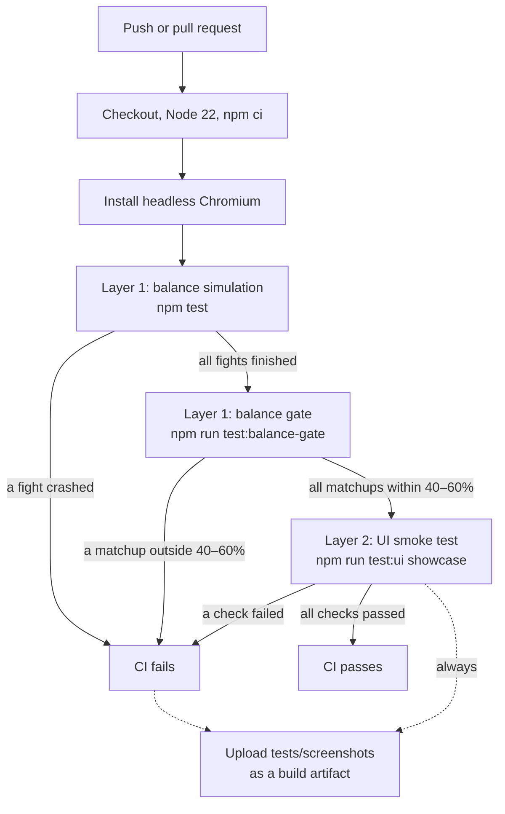

# Testing

Drake Arena is a single HTML file with no build step, so the tests work on that file as it is. The testing has two layers:

1. **Balance simulation** (`tests/balance.js` + `tests/sim_harness.js`) runs the real game code in Node and plays thousands of fights. It answers: *is the game fair, and does combat ever crash?*
2. **UI smoke test** (`tests/ui.js`) opens the page in headless Chromium, plays it through fake chat and checks the layout rules. It answers: *does it work and look right on stream?*

Both run in CI on every push and pull request (`.github/workflows/ci.yml`).

## Pipeline



## Layer 1: balance simulation

`balance.js` pulls the inline `<script>` out of `showcase/index.html` and runs it in Node. It uses a stub DOM and a timer queue that drains straight away, so a fight that takes about two minutes on stream finishes in milliseconds. Nothing is copied from the game: the sim calls the real `runBattle`, the real stat formulas and the real `TITLES_DB`, so what it measures is exactly what viewers get.

| Command | What it measures | Target |
|---|---|---|
| `node tests/balance.js matrix 300 20` | Every element against every other, at level 20 | Each matchup within ~45–57% |
| `node tests/balance.js tiers 600` | Each title rarity against Common titles, at levels 1, 10 and 20 | Each rarity beats Common by a bit more than the rarity below it |
| `node tests/balance.js levels 400` | How much a level gap matters | The higher level still clearly wins |
| `node tests/balance.js elements 200` | Overall win rate per element at levels 1, 10 and 20 | Close to 50% |
| `node tests/balance.js dragon 100` | The streamer's White Dragon against every viewer element, any title, levels 1/10/20 | Wins 100%; exits non-zero otherwise |
| `node tests/balance.js bonuses` / `rolls` | Every title bonus against Common; title roulette drop rates | Checked by hand |

`npm test` runs the first three plus `dragon`. The balance tables only cover the six viewer elements (`VIEWER_DRAKE_TYPES`); the White Dragon is deliberately unbeatable, so the `dragon` check asserts exactly that instead.

### Why it's seeded

`Math.random` is replaced with a seeded generator (mulberry32, default seed `12345`, change it with `--seed N`). The same seed and the same game code always give the same numbers, which means:

- **A difference is a real change.** When you change a number in `ELEMENT_TIERS` and red vs gold moves from 61% to 55%, the tuning did that, not luck. With a random seed, a few hundred fights per matchup shift by several percent between runs, which is as big as the effects you're tuning.
- **Results can be reproduced.** Anyone can rerun a table and get identical output.
- **Robustness is still checkable.** Run with a few different `--seed` values to confirm a result isn't an artifact of one seed.

### What fails CI

Two things fail the run:

- **A combat crash.** If any simulated fight logs a simulation error, the harness throws and `npm test` exits non-zero. Across the ~24,000 fights `npm test` plays, every element, title ability and buff/debuff comes up many times, so a code path that throws is very likely to be hit.
- **The balance gate.** `npm run test:balance-gate` runs `matrix 1500 20 --seed 12345 --bounds 40,60`: 1,500 fights for each of the 30 element matchups at level 20. It fails if any matchup falls outside 40–60%, and lists the ones that did. The bound is deliberately wider than the ~45–57% tuning target: it catches a change that clearly breaks an element, not normal tuning. Because the run is seeded, a failure is repeatable, not a flaky run. It takes about 45 seconds. Today every matchup is between 43% (gold vs red) and 55%.

Everything else (the tier and level tables, the 45–57% target) is printed for a person to read, not asserted. Balance there is a judgment call.

## Layer 2: UI smoke test

`ui.js` opens `showcase/index.html` in headless Chromium at 1920×1080, the OBS canvas size.

- **Fake tmi.js.** The Twitch chat library is swapped for a stub, so the test "types" chat messages through the same handler real Twitch messages use. No network or Twitch account is needed.
- **Fake clock.** Playwright's clock controls the game timers, so a full fight (30 s countdown plus up to 30 turns at 4.5 s each) runs in seconds, and the test can stop every 500 ms of game time to measure the layout.

First it checks the White Dragon is streamer-only: with no streamer set, `!дрейк білий` is refused; then it sets a streamer through **⚙️ Test Settings** (as `@TESTSTREAMER`, to check that `@` and case are ignored) and checks the name is saved and the chat simulator shows a streamer chip. It then registers all seven drake types (the six viewer elements plus the streamer's White Dragon), checks another viewer is refused with `!дрейк білий`, `!drake white` and `!рерол білий`, uses `!стата`, `!титул` (as a channel-point reward) and `!шанси`, plays a ranked fight through `!черга`, then friendly duels (`!бій` / `!прийняти`) until every drake type has been on screen.

| Check | What it catches |
|---|---|
| Every command gets a reply | A chat command that is ignored or throws before it answers |
| Each viewer's save has the right drake type | Color words mapped to the wrong element; saves not written |
| `!титул` gives the viewer a title | The channel-point reward path not reaching the title roll |
| Every fight finishes within 5 minutes of game time and logs no "Critical simulation error" | Fights that hang (a timer never fires, the queue never ends the battle) or crash partway through |
| HP bars never move vertically (sampled every 500 ms, tolerance 0.5 px) | Buff/debuff icons, long names or title badges pushing the card layout around (every card block has a fixed height to prevent this) |
| Every drake type's sprite painted pixels on its fighter-card canvas | Broken sprite data, a missing palette, a hidden canvas |
| The info feed never overflows its column (clipped at the bottom, too wide, or running past the column) | Chat reply cards cut off or spilling into the rest of the overlay |
| No page errors or `console.error` | Any uncaught exception anywhere during the run |
| The White Dragon is refused with no streamer set and for every other viewer; the streamer's dragon gets title 999 | The streamer-only check missing from a command path (`!drake`, `!reroll`, either language) |
| Old-save migration: a second page loads a save from before the Green Drake, then reloads | Viewers' `'white'` not becoming `'green'` (with XP kept), the streamer's dragon being converted, title 999 left on a non-dragon, or a second load changing the save again (not idempotent) |

It also saves screenshots at each stage to `tests/screenshots/` (`showcase-01-registered.png` … `showcase-07-all-fights-done.png`). CI uploads them as the `ui-screenshots` artifact even when the run fails, so you can see what the overlay looked like. Some layout bugs are easier to spot by eye than to assert, and the screenshots are how those get found.

## Running locally

Requires Node 18+ (CI uses Node 22).

```sh
npm ci
npx playwright install chromium        # once; CI adds --with-deps for Linux system libraries

npm test                               # balance: element matrix, title tiers, level gaps
npm run test:balance-gate              # CI balance gate: every matchup within 40–60% (~45 s)
npm run balance                        # quick per-element check (same as balance:showcase)
npm run test:ui showcase               # UI smoke test + screenshots in tests/screenshots/

node tests/balance.js matrix 300 20 --seed 42    # rerun with another seed
node tests/balance.js bonuses 600                # every title bonus vs Common
```

To check visuals yourself, open `showcase/index.html` in a browser and use the Chat Simulator or the Test Panel.

## Bugs the tests found

| Bug | Found by | Symptom | Fix |
|---|---|---|---|
| Info feed clipping | The UI test's automated info-feed overflow check | Tall reply cards (`!стата` stat cards, `!шанси` odds) could fill the chat-request panel before the 4-card limit was reached, so the oldest card was cut off at the bottom of its column | `addInfo` now also drops the oldest cards while the feed's content is taller than the panel, so every card on screen is shown whole |
| Title badge clipping | Manual visual review, **not** the tests: every automated check was passing at the time | The title badge under a fighter's name had its bottom edge cut off. It was an `inline-block` sitting on the text baseline, which put it about 5 px low inside its fixed-height, `overflow: hidden` container | `vertical-align: top` on `.fighter-title-badge` |

**Green automation doesn't prove readability.** The checks only catch what they measure: HP bars moving, the feed overflowing, errors. A badge cut off inside its own fixed-height box breaks none of those rules, so every test passed while the overlay looked wrong. Look at the screenshots (or the page itself) after any visual change.
