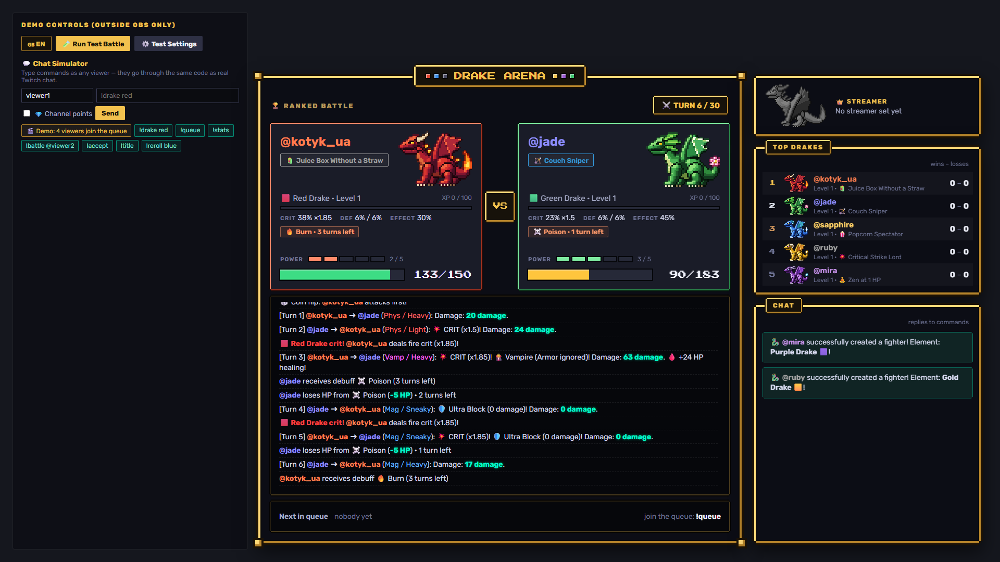

# ⚔️ Drake Arena

A Twitch chat mini-game that runs as a browser-source overlay. Viewers create a drake, pick an element, queue up and watch turn-based auto-battles play out on stream. It's a single HTML file with no build step and no backend.

**Try it without Twitch:** open `index.html` in a browser and use the **Chat Simulator** in the left column. Type commands as any viewer name, or press **🎬 Demo** to have four viewers join and fight.



## Features

- **6 elements**, each with its own passive, scaling at levels 5 / 10 / 15 / 20
- **White Dragon:** a bigger, unbeatable dragon that only the streamer can pick (see [below](#white-dragon-streamer-only))
- **194 titles** in seven rarities, from Common stat boosts to Legendary, Mythic and Meme titles with unique abilities
- **Chat-request window:** replies to viewers (`!stats` cards, title rolls, warnings) appear in their own panel, separate from the battle log
- **Turn-based combat** with physical, magic and vampire attacks, crits, armor, ultra-blocks, 12 buffs/debuffs (one of each per element), class ultimates on an Element Power meter, and a sudden-death phase
- **Ranked queue** with level-based matchmaking, plus friendly duels that give no XP
- **Progression:** XP, levels 1–20 and a win/loss leaderboard, saved in `localStorage`
- **Channel-point rewards** for title rolls and element rerolls
- **1920×1080 overlay** with pixel-art gold frames: the arena and a side column (streamer card, top drakes, chat replies) on the right, the camera column and the strip above the arena left free. Outside OBS the demo controls sit in the camera column and the whole stage scales down to fit the window
- **Ukrainian / English** interface and commands
- **Test panel:** set up any two drakes at any level with any title and run a fight
- **Chat simulator** that feeds the same handler as real Twitch messages

## Setup

1. Set your channel at the top of the script:
   ```js
   const TWITCH_CHANNEL = "yourchannel";
   ```
2. **OBS:** add a Browser Source pointing to the file with `?obs` on the end. For example:
   `file:///C:/DrakeArena/index.html?obs&lang=en`

   `?obs` makes the background transparent and hides the simulator, test panel and buttons (the left column stays empty for your camera, and the strip above the arena for alerts). `lang` can be `en` or `uk`.
3. *(Optional)* Set the streamer who owns the White Dragon. Either set it in the script:
   ```js
   let STREAMER_USER = "yourname";
   ```
   or type the name into **⚙️ Test Settings → Streamer**, which saves it in that browser and overrides the script value. Empty (the default) means nobody can pick the White Dragon.
4. *(Optional)* Create two channel-point rewards that require text. Paste their IDs into `REWARD_ID_TITLE` and `REWARD_ID_REROLL`. Until you do, any text reward is accepted.

Chat is read anonymously through [tmi.js](https://github.com/tmijs/tmi.js). The overlay never posts to chat. If tmi.js can't load, the page still works offline through the simulator.

## Chat commands

| English | Українська | What it does |
|---|---|---|
| `!drake <color>` | `!дрейк <колір>` | Create your drake: red, blue, black, gold, purple, green (`white` is the streamer's White Dragon) |
| `!queue` | `!черга` | Join the ranked queue |
| `!battle @name` | `!бій @нік` | Challenge someone to a friendly duel (30 s to answer) |
| `!accept` / `!decline` | `!прийняти` / `!відхилити` | Answer a challenge |
| `!stats` / `!profile` | `!стата` / `!профіль` | Level, progress, HP/crit/defense, wins/losses, title and its bonus |
| `!title` | `!титул` | Roll a random title *(channel points)* |
| `!odds` / `!chances` | `!шанси` | Show the title roulette drop chances |
| `!reroll <color>` | `!рерол <колір>` | Change element and reset to level 1 *(channel points)* |

`!queue` and `!battle` have a 3-minute cooldown. The broadcaster is exempt.

## How combat works

**Base stats:** 150 HP + 10 per level. Defense is 5% + 1% per level, capped at 65%. Crit chance is 15% + 1% per level, dealing 1.5× damage. Each hit that deals damage has a 30% chance (plus element and title bonuses) to cast a buff or debuff (see [Buffs and debuffs](#buffs-and-debuffs)). Everyone has a 10% ultra-block chance, which reduces a hit to 0 damage.

| Element | Passive (grows with level tier) |
|---|---|
| 🟥 Red | +13–14% crit, crit damage 1.85–2.05× |
| 🟦 Blue | +8–14 defense; 11–18% chance to reflect half the damage back |
| ⬛ Black | +3–10% ultra-block; +18–27% effect chance |
| 🟨 Gold | +50–90% XP; 7–9% chance for a hit to leave the enemy at exactly 1 HP |
| 🟪 Purple | Buffs and debuffs 25–40% stronger; +20–35% effect chance |
| 🟩 Green | +22–34% max HP |

All element numbers live in `ELEMENT_BASE` (the level-1 value) and `ELEMENT_TIERS` (the bonus at levels 5 / 10 / 15 / 20). They were tuned with a balance simulator (with the class ultimates in play) so every element matchup at levels 1, 10 and 20 stays within 45–57%, apart from a few known counters that sit within 2 points of that range (see [TESTING.md](../TESTING.md#known-counters)).

### White Dragon (streamer only)

`!drake white` / `!дрейк білий` works only for the user in `STREAMER_USER`; anyone else gets a refusal in the chat-request window, and `!reroll white` is refused the same way. The White Dragon uses a bigger 60×42 wyvern sprite (drakes are 48×36; all sprites face left and are shown at 3× on the fighter cards) and is deliberately a one-sided spectacle, not a balanced element:

- Starts at level 20 with the special title 👑 **Sovereign of the Aether** / **Владика Етеру** (Divine rarity, never rolled by `!title`, and `!title` is refused for the dragon)
- 99,999 HP, 100% defense, 100% crit at ×100, 100% effect chance
- Every hit it deals ignores ultra-blocks and armor; every hit it takes is dissolved to 0
- Ignores Blue reflect, Gold's 1-HP hit and Thorns, and is immune to debuffs

When the streamer setting changes, the White Dragon stays with the streamer only (see saves below). The Test Panel can also put the White Dragon on a test fighter.

**Each turn** (every 4.5 s, attackers alternate after a coin flip for who goes first):

1. Effects that last turns act first: Burn, Poison and Regeneration (see below). A frozen drake (❄️ Frost) then skips its attack.
2. The attack type is rolled:
   - 45% physical, 45% magic. Each can be light, heavy or sneaky. Sneaky ignores armor.
   - 10% vampire. It ignores armor and heals the attacker for half the damage dealt.
3. Modifiers are applied in order: Rage / Weakness / Divine Might (and the defender's Rage penalty), sudden death, title abilities, crit (Blessing, Mark), ultra-block (Shadow; Divine Might can't be blocked), armor, then Shield.
4. The attack uses up one of the attacker's "attacks" effects and one of the defender's "hits taken" effects.
5. Element procs are checked: Blue reflect and Gold's 1-HP hit.
6. If the hit dealt damage, a buff or debuff may be cast.

**Sudden death** starts at turn 16 and adds +30% damage every turn. If both drakes are still alive after turn 29, the one with more HP wins.

### Buffs and debuffs

Each element has one buff (cast on itself) and one debuff (cast on the opponent). The descriptions below are the ones the game shows (card tooltips); they are filled in from the `EFFECTS` numbers, and `npm test` fails if this table falls out of step with them. When a cast triggers, 70% of the time it's one of the caster's own two (50/50 buff or debuff), 30% of the time any of the 12. The White Dragon always picks from all 12.

| Element | Buff | Debuff |
|---|---|---|
| 🟥 Red | 💢 **Rage** (Лють): Next 2 own attacks deal +40% damage, but takes +15% damage until it ends | 🔥 **Burn** (Підпал): 5% max HP damage at the start of each of the target's next 3 turns |
| 🟦 Blue | 🛡️ **Shield** (Щит): Next 2 hits taken deal −30% damage (armour-piercing and vampire too) | ❄️ **Frost** (Мороз): The target skips its next attack |
| ⬛ Black | 🌑 **Shadow** (Тінь): +25% ultra-block chance for the next 2 hits taken | 🥀 **Weakness** (Слабкість): The target's next 2 attacks deal −40% damage |
| 🟨 Gold | 🍀 **Blessing** (Благословіння): Next 2 own attacks get +60% crit chance | 🎯 **Mark** (Мітка): The next hit on the target is a guaranteed crit |
| 🟪 Purple | 🌟 **Divine Might** (Божественна міць): Next own attack deals ×1.55 damage and can't be blocked | 💨 **Dispel** (Розвіювання): Removes all of the target's buffs at once |
| 🟩 Green | 💚 **Regeneration** (Регенерація): Heals 6.5% max HP at the start of each of the owner's next 3 turns | ☠️ **Poison** (Отруєння): 3% max HP damage at the start of each of the target's 3 turns, and its healing is −50% |

- **Durations** count what each effect names: the owner's own attacks, the hits it takes (a blocked hit still counts), or the start of its turns. The rules are the same for both fighters. Fighter cards show what's left in words, e.g. "💢 Лють · ще 2 атаки" / "💢 Rage · 2 attacks left".
- **Limits:** at most 2 buffs and 2 debuffs per drake. Casting an active effect again refreshes it. With 2 already, a new one replaces the one closest to ending (the older one on a tie). Both are logged.
- **Effect power** (Purple, "effect strength" titles) scales the percentages, never the counts. Shield and Weakness are capped at −90%, Poison's healing cut at 100%.
- **Dispel never goes to waste:** if the target has no buffs to remove, a different effect is cast instead (picked the usual way; Chaotic charge picks another debuff). On an immune target it still counts as cast and the log shows it was ignored.
- **Debuff immunity** (the Legendary ability, and the White Dragon) blocks every debuff, Dispel included.
- Title abilities draw from the same list: Opening buff picks one of the 6 buffs, Chaotic charge one of the 6 debuffs, Cat on the keyboard any of the 12.

All of this lives in one table, `EFFECTS` (with `EFFECT_CAST` for the cast split and slot limit); the fight code, fighter cards, battle log and balance sim all read from it. The numbers were tuned with the seeded balance matrix (see [TESTING.md](../TESTING.md)).

### Class ultimates

Every drake has a **Сила стихії / Element Power** meter from 0 to 5, empty at the start of each fight. It gains 1 for each own attack that deals damage, and 1 more, once per fight, the first time its HP drops below half. When it's full, the drake's next turn is its **ultimate** instead of a normal attack, and the meter goes back to 0. If that turn is skipped (❄️ Мороз), the ultimate waits for the next turn the drake acts. The ultimate itself never fills the meter. It's all automatic: there are no chat commands.

The fighter card shows the meter as 5 pips labelled "СИЛА" / "POWER", with "✦ ГОТОВО" / "✦ READY" when it's full (and Ice Mirror's hits left while it lasts). The log names the ultimate, e.g. "☄️ УЛЬТИМЕЙТ · Вогняний шторм" / "☄️ ULTIMATE · Firestorm".

| Element | Ultimate | What it does |
|---|---|---|
| 🟥 Red | ☄️ **Firestorm** (Вогняний шторм) | An attack for ×1.5 damage that can't be blocked; applies 🔥 Burn |
| 🟦 Blue | 💠 **Ice Mirror** (Крижане дзеркало) | Hits taken (2 hits left) are each absorbed up to 10% of max HP (the rest goes through), and 60% of what was absorbed goes back to the attacker |
| ⬛ Black | 🦇 **Shadow Theft** (Крадіжка тіні) | Takes the opponent's buffs with their remaining counts (up to its 2-buff limit, extras are removed), then attacks for ×1.4 damage; a guaranteed crit if the opponent had no buffs |
| 🟨 Gold | 🎰 **Jackpot** (Джекпот) | Three reels (💎 50%, 🪙 35%, 💀 15%): damage ×(1 + 1 per 💎); 2 or more 💀 is a miss |
| 🟪 Purple | ✴️ **Arcane Detonation** (Арканна детонація) | An attack for ×2.2 damage plus 50% per debuff on the opponent, then those debuffs are removed |
| 🟩 Green | 🌸 **Bloom** (Цвітіння) | Removes its own debuffs and instantly heals 25% max HP |

The descriptions are the ones the game shows (the meter's tooltip), filled in from the `CLASS_ULTIMATES` numbers; `npm test` fails if this table falls out of step with them. The White Dragon has no meter and no ultimate.

How ultimates fit with the rest:

- **Effect power** (Purple, effect-strength titles) never scales an ultimate's own numbers. The effect an ultimate applies (Firestorm's 🔥 Burn) follows the usual effect rules: the caster's effect power, the 2-per-kind limit, refresh and replacement.
- **Debuff immunity** blocks the debuff parts of an ultimate (Firestorm's Burn, Shadow Theft's theft) but never its damage.
- **No effect cuts damage or healing by more than 90%**, whatever its power.
- **Ultimates that attack** (Firestorm, Shadow Theft, Jackpot, Arcane Detonation) are rolled and resolved like any attack, with their extras on top: the attacker's and defender's effects, crits, armor, title abilities, sudden death, element procs and the usual cast roll all apply, and they count down "own attacks" and "hits taken" effects. **Ice Mirror and Bloom replace the attack**: no attack is made that turn, so (as on a frozen turn) only "turns" effects count down.
- **Ice Mirror** absorbs each hit only up to a share of the Blue drake's max HP; the rest goes through, and what goes back to the attacker is a share of what was absorbed. It blunts a burst rather than swallowing it. It is not a buff: Dispel and Shadow Theft can't take it. Every attack the Blue drake takes uses one of its hits, blocked or not, like any "hits taken" count. The White Dragon's hits go straight through it.
- **Shadow Theft** moves buffs before its attack, so a stolen buff (e.g. 💢 Rage) already counts for that attack. A stolen buff the thief already has merges with it (the one with more left stays). Stolen buffs fill free slots in order; any that don't fit are removed. The guaranteed crit depends on whether the target had buffs, even when immunity stops the theft.
- **Jackpot**'s miss is an attack that deals 0 (it still counts down attack and hit effects, and never casts).
- **Arcane Detonation** removes the debuffs it counted whether or not its hit lands.
- **Bloom** removes its own debuffs first, then heals instantly, so ☠️ Poison never cuts Bloom's heal. It gives no 💚 Regeneration.
- **Shadow Theft and Firestorm** each have a damage multiplier in `CLASS_ULTIMATES` (`dmgMult`).

**XP:** win +40, loss +10, draw +10 each. XP only counts in ranked fights. Reaching the next level takes `100 × level^1.4` XP, up to level 20.

## Titles

`!title` first rolls a rarity, then a random title of that rarity. `!odds` shows the chances in chat.

| Rarity | Drop chance | Titles | Bonus |
|---|---|---|---|
| Common | 45% | 80 | +9 HP, +10% crit or +7% defense |
| Uncommon | 25% | 30 | +18 HP, +16% crit, +13% defense or +15% effect chance |
| Rare | 15% | 40 | Two stats, e.g. +14% crit and +0.22 crit power |
| Epic | 9% | 20 | Stronger pairs, e.g. +40% effect strength and +12% effect chance |
| Legendary | 4.5% | 10 | A unique ability plus a small stat |
| Mythic | 1.3% | 8 | A unique ability plus HP per level |
| Meme | 0.2% | 6 | A chaotic ability |

**Title abilities** (numbers in `MECH`):

| Rarity | Ability | Effect |
|---|---|---|
| Legendary | Guardian shield | Heals 25% once when it drops below 15% HP |
| Legendary | Armor piercer | Ignores 70% of enemy defense |
| Legendary | Debuff immunity | Immune to debuffs (Dispel included) |
| Legendary | Quantum dodge | +10% ultra-block |
| Legendary | Chaotic charge | 15% chance to apply an extra debuff |
| Mythic | Opening buff | Starts every fight with a random buff |
| Mythic | Thorns | Returns 15% of damage taken to the attacker |
| Mythic | Lifesteal | Heals 15% of damage dealt |
| Mythic | Executioner | +50% damage to targets below 35% HP |
| Meme | Coin flip | Every hit deals ×1.5 or ×0.6 |
| Meme | Sleepy | 10% chance to sleep through a turn, otherwise +25% damage |
| Meme | Cat on the keyboard | 25% chance of any of the 12 effects, cast by either fighter |

## Bugs found and fixed

This project went through a QA pass. Each fix was verified by simulating all 36 element matchups plus targeted command scenarios.

| # | Bug | Impact | Fix |
|---|---|---|---|
| 1 | Chat handler read `context.channel`, which tmi.js doesn't provide | **Every chat message threw an error, so the game ignored chat entirely** | Use the `target` channel argument |
| 2 | The effect-chance formula referenced an undefined `tier` variable | Any fight with a Black or Purple drake crashed on its first attack | Use the attacker's own tier |
| 3 | Fighter 1 always attacked first | Structural advantage for whoever was listed first | Coin flip before each fight |
| 4 | Only the challenger got a cooldown after a duel | The accepting player could immediately queue again | Both players get the cooldown |
| 5 | Ranked opponents were picked at random | A level 1 drake could be paired against a level 20 | Pick the queued player with the closest level |
| 6 | The "buff strength" title gave non-Purple drakes the full Purple bonus | The +15% title actually gave up to +55% | One `getEffectMult()` formula used everywhere |
| 7 | Burn and poison were scaled by the **victim's** effect strength | Purple drakes took *extra* damage from debuffs, and their own debuffs weren't stronger | Each debuff stores the strength of the drake that applied it |
| 8 | The leaderboard showed the word "Drake" instead of the element icon | Cosmetic | Take the last word of the name |
| 9 | Switching language reset fighter names to "Waiting…" and left the queue text untranslated | Cosmetic | Re-render only the static labels |
| 10 | If tmi.js failed to load, the whole script stopped | Page dead when offline | Twitch connection is optional |

## Project structure

Everything is in `index.html`:

- `TITLES_DB`, `DRAKE_TYPES`: game data. `DRAGON_TYPE` (`'white'`) is the streamer-only dragon; `VIEWER_DRAKE_TYPES` is everything else, used for random picks
- `STREAMER_USER`, `isStreamer`, `setStreamerUser`: who owns the White Dragon
- `RARITIES` (drop chances), `ELEMENT_BASE` / `ELEMENT_TIERS` (element passives), `MECH` (title abilities): balance numbers — tune these, not the fight code
- `titleStats`, `getMaxHP`, `getModifiedDefenses`, `getCritStats`, `getEffectMult`, `getTierMultiplier`: stat calculations
- `handleChatMessage`: command parsing, shared by Twitch and the simulator
- `EFFECTS`, `EFFECT_CAST`: the 12 buffs/debuffs (icon, names, description, what counts them down, numbers) and the cast rules; `getCastChance` is the cast chance
- `CLASS_ULTIMATES`, `METER`: the six class ultimates (icon, names, numbers, description) and the Element Power meter; `ultimateFor`, `describeUltimate`, `renderPowerMeter` (the meter row on the fighter cards)
- `checkQueue`, `runBattle`, `pickEffect`, `applyEffect`, `finishBattle`: matchmaking and the combat loop (`applyEffect` handles refresh, replacement, Dispel and immunity; `runBattle` fills the meter and plays the ultimates)
- `addInfo`, `showStatsCard`, `showTitleRoll`, `showOddsCard`: the chat-request window
- `renderLeaderboard`, `updateFighterCard`, `updateStatusUI`: UI rendering; `renderStreamerCard`, `renderHowTo`, `setArenaState` (the header), `renderResultTags` (winner/loser cards); `nameColor` (minimum name brightness), `fitText` (shrinks long text), `fitStage` (scales the stage outside OBS)
- `migrateOldSaves`, the chat simulator and page init are at the end of the script

Save data lives in the browser's `localStorage` under the keys `drake_arena_showcase_db` and `drake_arena_showcase_stats` (plus `drake_arena_showcase_streamer` for the Test Settings streamer). To reset, clear site data. Saves from older versions are upgraded automatically on load: titles keep their ID and pick up the new names and bonuses. `'white'` used to be the viewers' White Drake, so any White Drake that doesn't belong to the streamer becomes a Green Drake with the same stats and XP, and title 999 is re-rolled on anything that isn't the dragon. The upgrade is idempotent: running it again changes nothing.

## Credits

Built with AI assistance (Claude Code); design, testing and balance by Heaxyle.
